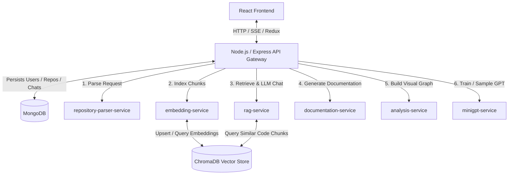

# CodeInsight AI: Complete Project Walkthrough & System Architecture Guide

Welcome to the comprehensive guide for **CodeInsight AI**, a production-oriented repository intelligence platform and educational transformer laboratory. This document is designed to help you, an interviewer, or any developer understand the product inside out—covering everything from high-level features and architecture to low-level parsing strategies, mathematical formulations, and step-by-step data flows.

---

## 1. Executive Summary & Vision

### What is CodeInsight AI?
CodeInsight AI is a developer tool designed to bridge the gap between codebase complexity and developer understanding. It enables developers to import codebases (via remote GitHub repository URLs or local ZIP archives), parses their structure using Abstract Syntax Trees (ASTs), generates vector embeddings for semantic search, indexes the code blocks in a vector database, and exposes an interactive chat assistant capable of answering complex repository-level questions.

### Phase 1 vs. Phase 2
The project is split into two distinct operational scopes:
1. **Phase 1: Production-Ready RAG Copilot**: A system leveraging modern vector search (ChromaDB), document database persistence (MongoDB), an Express.js API gateway, and 5 FastAPI microservices. It connects to industry-grade Large Language Models (Gemini, Groq, or OpenRouter) to stream context-grounded responses to the client.
2. **Phase 2: Educational MiniGPT Lab**: A sandboxed training simulation built completely from scratch using **pure NumPy** (no PyTorch, TensorFlow, or Autograd). It runs tokenization, causal self-attention, GELU activation, layer normalization, backpropagation, and Adam weight updates in real-time right in the browser, showing how a GPT model is actually trained from first principles.

---

## 2. System Architecture

The project is structured as a decoupled microservices architecture. A central Node.js/Express API Gateway serves as the orchestrator, while CPU-bound operations (parsing, embedding, analysis, RAG, and GPT training) are offloaded to specialized Python microservices.



### Tech Stack Breakdown
*   **Frontend**: React (TypeScript/JSX), Redux Toolkit (state management), TanStack Query (caching and API syncing), Monaco Editor (interactive code viewing), Lucide Icons, and custom CSS layouts.
*   **API Gateway**: Node.js, Express, Mongoose (MongoDB ODM), Multer (multipart form handling for ZIP uploads), and JSON Web Tokens (JWT) for secure authentication.
*   **Microservices Backend**: FastAPI (Python 3.10+), PyDantic (data validation), Uvicorn (ASGI web server).
*   **Databases**: MongoDB (structured documents), ChromaDB (vector database).
*   **AI/ML Libraries**: Sentence-Transformers (local embedding models), NumPy (MiniGPT implementation), HTTPX (asynchronous API calls to Groq/Gemini/OpenRouter).

---

## 3. Core Operational Flows (Step-by-Step)

Let's trace how data moves through the system during primary operations.

### Flow A: Repository Ingestion & Parsing (Phase 1)
When a user inputs a GitHub URL or uploads a ZIP archive, the following sequence is triggered:

```
[User Interface]
       │
       ▼ (1) Uploads ZIP or submits GitHub URL
[Express API Gateway]
       │
       ├─► (2) Creates Repository document in MongoDB (status: "queued")
       │
       ├─► (3) Dispatches async pipeline run
       │
       ▼ (4) POST /parse
[repository-parser-service]
       │
       ├─► Clones repo (shallow depth=1) or unzips archive in temp folder
       ├─► Scans directories, filtering out 'node_modules', '.git', '.venv', etc.
       ├─► Runs AST parser (for Python) or regex structures (JS, TS, C++, Java)
       ├─► Segments source code into semantic symbol blocks & sliding-window chunks
       │
       ▼ (5) Returns parsed JSON RepositoryAnalysis payload
[Express API Gateway]
       │
       ├─► Saves AST parse data (files, symbols, imports) in MongoDB
       ├─► Sets Repository status to "embedding"
       │
       ▼ (6) POST /index
[embedding-service]
       │
       ├─► Formats code blocks with file path, language, and symbol headers
       ├─► Vectorizes chunks using sentence-transformers (or SHA256 fallback)
       ├─► Upserts vector representations and metadata into ChromaDB
       │
       ▼ (7) Returns success
[Express API Gateway]
       │
       ▼ (8) Sets Repository status to "ready" in MongoDB
[User Interface] (Refreshes workspace via TanStack Query polling)
```

#### Ingestion Code Details
*   **Security Regex Sanitization**: The parser service validates GitHub URLs using `GITHUB_URL_RE`. It enforces character limits and formats (`owner` and `repo` segments must match `^[A-Za-z0-9][A-Za-z0-9._-]*$`) to prevent path traversal or shell injection attacks.
*   **Language-Specific AST Extraction**: Python files are parsed using Python's native `ast.parse` module to map classes, functions, and nested methods accurately. For C-style syntaxes (JavaScript, TypeScript, Java, C++), the parser uses a brace-depth algorithm (`_find_block_end`) that counts opening and closing braces while skipping comments and string literal scopes to find class/function boundaries.
*   **Chunking Strategy**: 
    1. First, chunks are created for every extracted code symbol (class/function scope).
    2. Gaps between symbol blocks are filled using a sliding-window chunker (120 lines).
    3. Windows that overlap by more than 80% with an existing symbol chunk are skipped to avoid redundant embeddings.
    4. Each chunk is assigned a deterministic ID: `repositoryId:hash(filePath:startLine:endLine:content[:80])`. Deduplication checks prevent ChromaDB `DuplicateIDError`.

---

### Flow B: Semantic Search & Streaming RAG Chat
When a user asks the assistant a question inside the repository chat panel, the system executes a Retrieval-Augmented Generation workflow:

```
[User Interface]
       │
       ▼ (1) POST /repositories/:id/chat/stream
[Express API Gateway] (Validates JWT, proxies stream request)
       │
       ▼ (2) POST /repositories/:id/chat/stream
[rag-service]
       │
       ├─► (3) Converts user query into query embedding vector
       │
       ├─► (4) Queries ChromaDB collection for the top 8 closest code chunks
       │
       ├─► (5) Builds grounded prompt:
       │       "Answer the developer's question using only the retrieved context..."
       │
       ├─► (6) Dispatches prompt to LLM (Groq, Gemini, or OpenRouter)
       │
       ▼ (7) Streams tokens back in Server-Sent Events (SSE) format
[Express API Gateway] (Streams chunk data back in real-time)
       │
       ▼ (8) Renders tokens dynamically; appends citations panel at completion
[User Interface]
```

#### SSE Streaming Protocol Implementation Detail
The SSE protocol uses double newlines (`\n\n`) to demarcate events. If an LLM response contains literal newline characters, they would break the SSE parser on the client. To resolve this, the `rag-service` escapes literal newlines during serialization:
```python
escaped_token = token.replace("\n", "\\n")
yield f"data: {escaped_token}\n\n"
```
The client React app receives these escaped tokens, reverses the replacement, and passes the reconstructed markdown to the renderer. At the end of the stream, custom SSE events (`event: citations` and `event: done`) transmit the metadata payload containing referenced file paths and line ranges.

---

### Flow C: Dependency Graph & Code Explanation
The workspace interface includes interactive visualizations of code relationships:
1.  **Architecture Graph**: The `analysis-service` reads parsed repository metadata and filters symbols and dependencies (limiting symbols to 250 and dependencies to 500 nodes to keep rendering lightweight). It formats this data into a node-edge JSON list compatible with graph libraries.
2.  **File Purpose Generator**: When a file is opened, the user can request a structural explanation. The `analysis-service` groups the file's symbols:
    *   If it finds classes or API routes, it auto-generates a purpose statement: *"Defines classes: ClassName. Exposes API routes: GET /route."*
    *   If no symbols exist, it parses the first 30 lines of source code and extracts comments (`//`, `#`, `/*`, `"""`) to output a docstring fallback explanation.

---

## 4. Phase 2: MiniGPT Transformer Lab (Theory & Code Deep Dive)

The MiniGPT Lab is a self-contained learning environment designed to demonstrate the inner workings of a generative transformer model. Instead of relying on a black-box PyTorch model, **every layer, forward pass, and backpropagation update is written in raw NumPy** inside [model.py](file:///c:/Users/Abhishek/Desktop/AIinsight_copilot_/services/minigpt-service/model.py).

```
[User Interface] (Configures parameters & imports text corpus)
       │
       ▼ (1) POST /lab/init
[minigpt-service]
       │
       ├─► Tokenizes corpus character-by-character (SimpleCharTokenizer)
       ├─► Instantiates NumPyCausalGPT model with selected hyperparameters:
       │   - Embedding size (n_embd)
       │   - Multi-head attention count (n_head)
       │   - Transformer block layers (n_layer)
       │   - Maximum sequence length (block_size)
       │
       ├─► (2) POST /lab/train-step (User clicks "Train Step" or "Auto Train")
       │   ├─► Samples random batch inputs (X, Y) from tokenized corpus
       │   ├─► Forward Pass: Calculates token predictions and cross-entropy loss
       │   ├─► Backward Pass: Propagates gradients back through all layers
       │   ├─► Parameter Update: Computes Adam optimizer updates with gradient clipping
       │   └─► Returns step count, training loss, and gradient magnitudes
       │
       ├─► (3) POST /lab/generate (User requests model text generation)
       │   ├─► Encodes user seed text
       │   └─► Samples tokens autoregressively (using Temperature and Top-K)
       │
       ▼ (4) Renders real-time training loss graphs and text generation outputs
[User Interface]
```

### The Causal GPT Architecture
The model replicates standard Decoder-only GPT architecture parameters:

$$x_{\text{input}} \rightarrow \text{Token + Positional Embeddings} \rightarrow \text{[Transformer Block]}_{1..N} \rightarrow \text{LayerNorm} \rightarrow \text{LM Head Logits}$$

Inside each Transformer block, the input undergoes Layer Normalization, Causal Multi-Head Attention, a Residual Add connection, another Layer Normalization, a Multi-Layer Perceptron (MLP) block, and a final Residual Add:

$$z_{\text{mid}} = z_{\text{in}} + \text{MultiHeadAttention}(\text{LayerNorm}(z_{\text{in}}))$$
$$z_{\text{out}} = z_{\text{mid}} + \text{MLP}(\text{LayerNorm}(z_{\text{mid}}))$$

---

### Key NumPy Layer Implementations

#### 1. Layer Normalization (Forward & Backward)
LayerNorm normalizes features across the embedding dimension to prevent scaling explosions:
$$\mu = \frac{1}{C}\sum x_i, \quad \sigma^2 = \frac{1}{C}\sum (x_i - \mu)^2, \quad \hat{x} = \frac{x - \mu}{\sqrt{\sigma^2 + \epsilon}}$$
$$y = \gamma \hat{x} + \beta$$

*   **Forward**:
    ```python
    mean = np.mean(x, axis=-1, keepdims=True)
    var = np.var(x, axis=-1, keepdims=True)
    x_norm = (x - mean) / np.sqrt(var + eps)
    out = gamma * x_norm + beta
    ```
*   **Backward**:
    The backward pass computes analytical derivatives for scale weights ($\gamma$), shift weights ($\beta$), and input activations ($x$) across batch and sequence dimensions:
    ```python
    dgamma = np.sum(dout * x_norm, axis=(0, 1))
    dbeta = np.sum(dout, axis=(0, 1))
    dx_norm = dout * gamma
    dx = (1.0 / C) / np.sqrt(var + eps) * (
        C * dx_norm - 
        np.sum(dx_norm, axis=-1, keepdims=True) - 
        x_norm * np.sum(dx_norm * x_norm, axis=-1, keepdims=True)
    )
    ```

#### 2. GELU (Gaussian Error Linear Unit) Activation
GELU is used in the feed-forward MLP layers of GPT architectures:
$$\text{GELU}(x) = 0.5x \left(1.0 + \tanh\left(\sqrt{\frac{2}{\pi}} \left(x + 0.044715 x^3\right)\right)\right)$$

*   **Forward**:
    ```python
    return 0.5 * x * (1.0 + np.tanh(np.sqrt(2.0 / np.pi) * (x + 0.044715 * x ** 3)))
    ```
*   **Backward**:
    ```python
    tanh_arg = np.sqrt(2.0 / np.pi) * (x + 0.044715 * x ** 3)
    tanh_val = np.tanh(tanh_arg)
    dtanh = 1.0 - tanh_val ** 2
    sech2_term = dtanh * np.sqrt(2.0 / np.pi) * (1.0 + 3.0 * 0.044715 * x ** 2)
    dgelu = 0.5 * (1.0 + tanh_val) + 0.5 * x * sech2_term
    return dout * dgelu
    ```

#### 3. Causal Multi-Head Self-Attention
Causal Self-Attention allows each token to query previous tokens while blocking attention to future tokens.
1.  **Q, K, V Projections**: Query, Key, and Value matrices are projected from inputs ($X$) using learned weights ($W_q, W_k, W_v$).
2.  **Split Heads**: Projections are reshaped from $(B, T, C)$ to $(B, T, h, d)$ and transposed to $(B, h, T, d)$.
3.  **Scaled Dot-Product**: 
    $$\text{Scores} = \frac{Q K^T}{\sqrt{d}}$$
4.  **Causal Masking**: Values above the diagonal are set to $-\infty$, ensuring they result in $0$ attention weights after softmax:
    ```python
    mask = np.tril(np.ones((T, T)))
    scores = np.where(mask == 0, -np.inf, scores)
    ```
5.  **Softmax & Attention Output**:
    $$A = \text{Softmax}(\text{Scores})$$
    $$Y = A V$$
6.  **Output Projection**: $Y$ is merged back to $(B, T, C)$ and projected through $W_o$.

*   **Backward Pass Math**: Self-Attention backpropagation requires calculating gradients for all projected heads and multiplying them back through the transposition matrices. The gradients for the attention matrix ($dA$), scores ($d\text{scores}$), queries ($dQ$), keys ($dK$), and values ($dV$) are recursively calculated using matrix multiplication products:
    *   $dV_{\text{heads}} = A^T dY_{\text{heads}}$
    *   $dA = dY_{\text{heads}} V_{\text{heads}}^T$
    *   $d\text{scores} = \text{softmax\_backward}(dA, A)$
    *   $dQ_{\text{heads}} = \text{scale} \cdot (d\text{scores} K_{\text{heads}})$
    *   $dK_{\text{heads}} = \text{scale} \cdot (d\text{scores}^T Q_{\text{heads}})$

#### 4. Loss Function (Cross-Entropy)
The model outputs a probability distribution over the vocabulary for each sequence index. The loss is calculated using Multi-Class Cross-Entropy:
$$\mathcal{L} = -\frac{1}{B \cdot T}\sum_{b=1}^{B}\sum_{t=1}^{T} \log P(\text{target}_{b,t})$$

During the backward pass, the gradient of the loss with respect to the pre-softmax logits is simply:
$$\frac{\partial \mathcal{L}}{\partial \text{logit}_i} = P_i - Y_{\text{target}}$$

#### 5. Backpropagation Optimizer (Adam)
After all gradients are calculated, the parameters are updated using the Adam optimizer:
$$m_t = \beta_1 m_{t-1} + (1-\beta_1) g_t, \quad v_t = \beta_2 v_{t-1} + (1-\beta_2) g_t^2$$
$$\hat{m}_t = \frac{m_t}{1 - \beta_1^t}, \quad \hat{v}_t = \frac{v_t}{1 - \beta_2^t}$$
$$\theta_t = \theta_{t-1} - \frac{\eta}{\sqrt{\hat{v}_t} + \epsilon} \hat{m}_t$$

To maintain mathematical stability, the gradients are clipped to a maximum norm of $1.0$ (gradient clipping) before being passed to Adam.

---

## 5. Technical Highlights & Engineering Trade-offs

Here are the key engineering decisions and trade-offs made during development:

1.  **ChromaDB Collection Isolation**: In typical production platforms, all repositories might be stored in a single large vector database index, using metadata filters to isolate queries. In CodeInsight AI, **each repository has its own isolated collection** (`repo_repoId`). This ensures that:
    *   Deleting a repository is a simple $O(1)$ collection drop operation.
    *   There is zero risk of data leakage or cross-contamination between different users' repositories.
2.  **Sentence-Transformers Caching**: Loading an embedding model from disk takes significant time and memory. The `embedding-service` uses an `lru_cache` decorator:
    ```python
    @lru_cache(maxsize=1)
    def _load_sentence_transformer():
        return SentenceTransformer(model_name)
    ```
    This ensures that the model is initialized only once and stays in memory for subsequent search and index requests.
3.  **Local Mock Hashing Fallback**: To allow the application to run out-of-the-box on developer laptops without GPU acceleration, CUDA drivers, or heavy PyTorch libraries, the system falls back to a deterministic SHA256-based token-hashing algorithm if sentence-transformers fails to import. This ensures the ingestion and search flows are always testable locally.
4.  **Multi-Tenant Isolation in MiniGPT Service**: GPT model states are stored in an in-memory dictionary keyed by `x-user-id` (passed by the Express gateway JWT claims). This enables multiple users to train their models concurrently without overwriting weights.

---

## 6. Interview Q&A Guide

### Q1: How does CodeInsight AI handle large file uploads without exhausting server memory?
**Answer**: Large ZIP archives are handled by Multer on the Express API gateway, which streams the uploaded payload directly to a temporary folder on disk (`server/uploads/`) rather than loading the file into RAM. Once saved, the gateway passes the absolute file path to the parser service. The parser extracts the codebase file-by-file inside a temporary work directory, processes it, and returns the metadata. The gateway then deletes the temporary ZIP archive from the local file system.

### Q2: Why did you choose a Python backend for parsing and embeddings instead of doing it in Node.js?
**Answer**: Python has robust, native ecosystem libraries for scientific computations and AI.
*   The `ast` module in Python is extremely efficient for parsing source code files into AST trees.
*   Embedding models (SentenceTransformers) and vector store client libraries (ChromaDB) are natively written in Python, meaning they can run in-process without requiring child processes or bindings.
Using a Node.js Express server as an API Gateway and offloading heavy lifting to Python microservices leverages the strengths of both ecosystems: Express's asynchronous I/O for handling web traffic, and Python's computational ecosystem for processing data.

### Q3: What is Retrieval-Augmented Generation (RAG) and why is it necessary here?
**Answer**: RAG is a design pattern used to ground Large Language Models with external domain knowledge. LLMs have a fixed knowledge base determined at their training cutoff and cannot answer questions about private codebases. By extracting code chunks, generating embeddings, performing semantic search, and injecting the most relevant code blocks directly into the model's system prompt, we provide the LLM with the context it needs to answer questions accurately without needing to fine-tune the model itself.

### Q4: Explain the sliding window chunking strategy. Why not just split by character length?
**Answer**: Splitting code purely by character length can break functions or class declarations in half, cutting off critical semantic context. CodeInsight AI uses a hybrid approach:
1.  **Symbol-based Chunking**: It identifies classes and functions using ASTs and creates dedicated chunks for them, preserving the complete code structure.
2.  **Sliding Window Gap-Filling**: For code blocks that do not fall inside a class or function (e.g., global variables or setup configurations), it uses a sliding window chunker.
3.  **Deduplication Overlap**: To prevent duplicate embeddings, a window is skipped if more than 80% of its lines overlap with an existing symbol chunk.

### Q5: How does the causal mask work in the MiniGPT model?
**Answer**: Standard self-attention allows every token to look at every other token in the sequence. In generative language modeling, when predicting the next token, the model must not be allowed to "peek" into the future. A causal mask is a lower-triangular matrix filled with ones on and below the diagonal, and zeros above. In the attention calculation, we set the zeros in the mask to $-\infty$ in the score matrix:
$$\text{scores}_{i,j} = -\infty \quad \text{if } j > i$$
When we apply softmax, $e^{-\infty}$ becomes $0$, which completely cuts off information flow from future tokens.

### Q6: Why did you write backpropagation manually in NumPy instead of using PyTorch?
**Answer**: The MiniGPT Lab is designed as an educational sandbox. Frameworks like PyTorch hide backward pass calculations behind autograd systems (`loss.backward()`). Writing the backward pass from scratch using NumPy requires implementing the exact chain-rule derivatives for LayerNorm, GELU, Dense Layers, and Causal Attention. This demonstrates a deep understanding of the mathematical mechanics of deep learning and proves the model operates on first principles.
